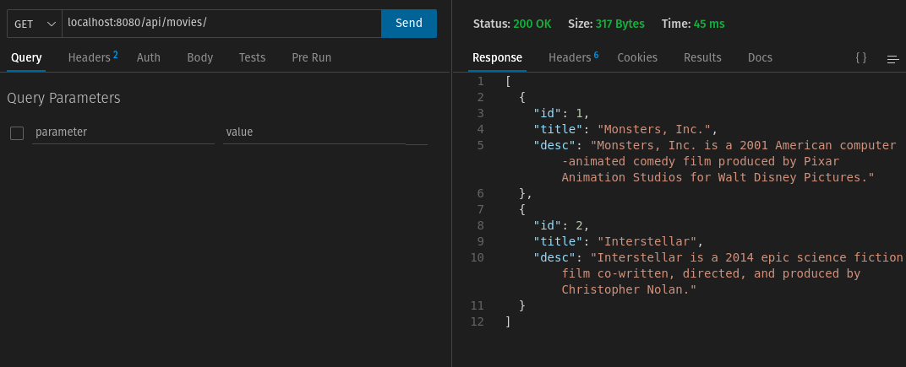
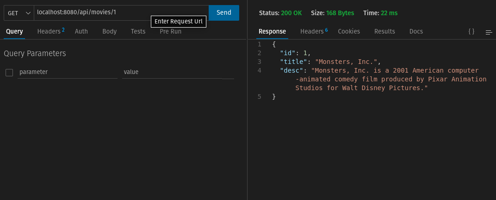
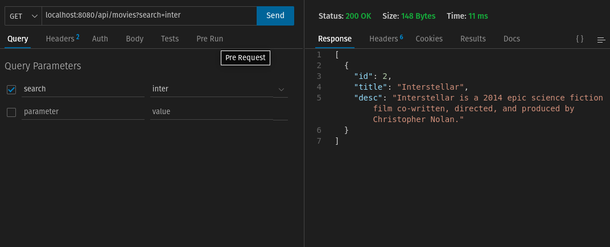
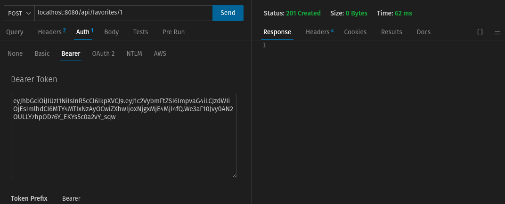
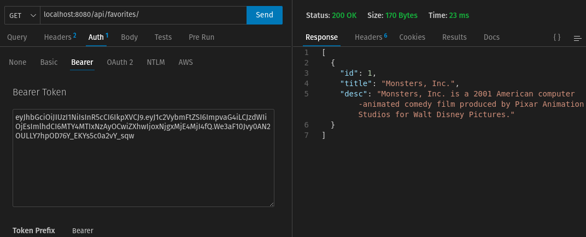
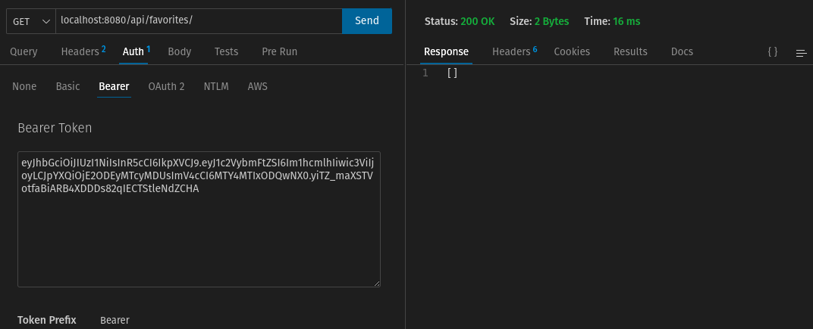
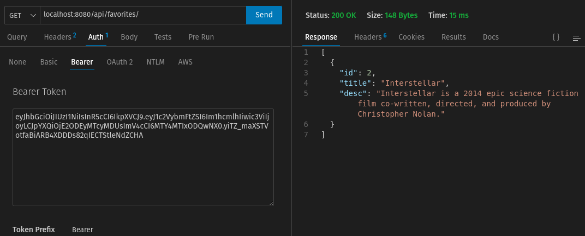
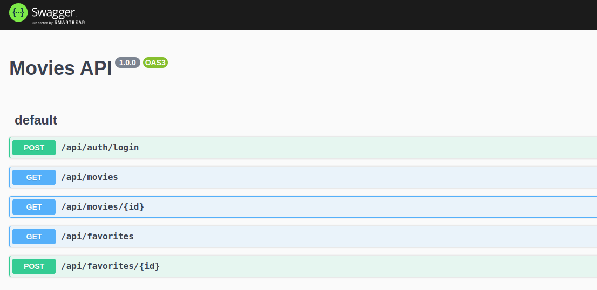

# Monstar Movies API

This is RESTful API made by NestJS. It is developed and tested under Ubuntu environment. Authentication is not fully implemented and 2 user credentials are hard-coded. Logging in will be shown below.

## Setup

First we need to set up DB.
Run below to run DB container.

`docker-compose up db`

Open another terminal, go to backend folder and run below commands.

```
cd backend && npm run db:create

npm run migration:run

npm run seed
```

## Run the API

Now stop the container in the first terminal and run all the containers.

`docker-compose up`

API runs on the port 8080.

### GET /movies



### GET /movies/:id



### GET /movies?search={search}



### POST /favorites/:id

Login with 1st user credential and get access token

`curl -X POST http://localhost:8080/api/auth/login -d '{"username": "john", "password": "changeme"}' -H "Content-Type: application/json"`

Use the access token to call the API:



### GET /favorites

You can check the favorited movie list:



Now change to the 2nd user

`curl -X POST http://localhost:8080/api/auth/login -d '{"username": "maria", "password": "guess"}' -H "Content-Type: application/json"`

Get the access token and test the same endpoint and it'll return nothing.



After favoriting movie 2, it returns the correct list:



## API Documentation

Swagger documentation can be accessed on `http://localhost:8080/api`


